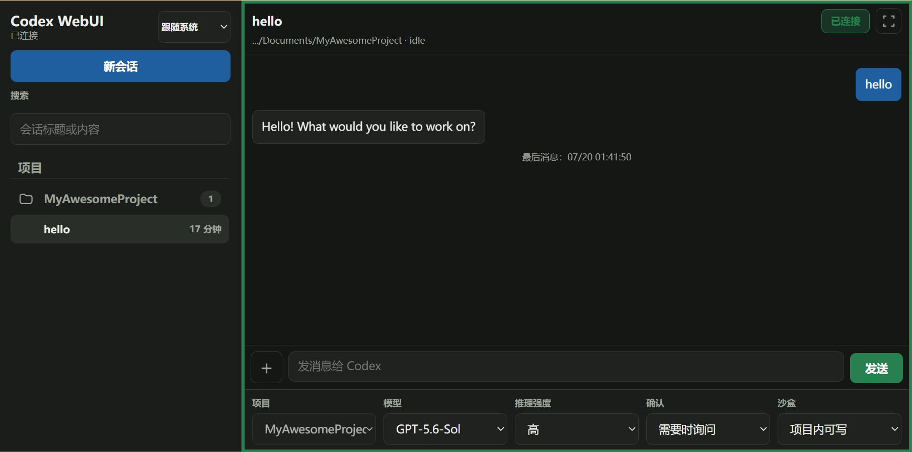
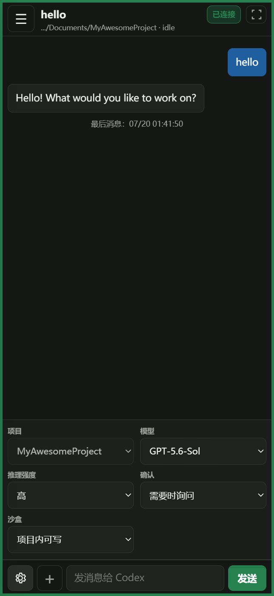

# Codex WebUI

[简体中文](README.md) | [English](README_EN.md)

Codex WebUI 是一个面向 OpenAI Codex 的本地自托管 Web 界面。它通过本机 [`codex app-server`](https://github.com/openai/codex/tree/main/codex-rs/app-server) 复用已登录的 Codex 账号，让手机、平板和电脑在同一局域网内创建、查看和继续 Codex 会话，无需单独填写 OpenAI API Key。支持中英文界面、响应式桌面/移动布局和按项目目录限制的访问 token。

## 安装

### 让 Codex 帮你安装（推荐）

把本仓库的 GitHub 链接交给 Codex，然后发送：

> 安装这个项目，运行测试并启动服务；最后告诉我怎样用手机扫码连接。

仓库里的 `AGENTS.md` 会告诉 Codex 完成安装、验证和安全初始化所需的步骤。

<details>
<summary><strong>手动安装</strong></summary>

要求：

- Node.js 20 或更新版本
- 已安装并登录 Codex CLI，或 Windows 上已安装 Codex 桌面应用

```powershell
npm install
npm run setup
npm test
npm start
```

`npm run setup` 会安装全局 `codex-webui` 命令。启动后，让手机与电脑连接同一局域网并扫描终端二维码；Windows 防火墙询问时请选择允许专用网络访问。

</details>

## 使用

| 桌面端 | 移动端 |
| :---: | :---: |
|  |  |

> [!WARNING]
> 访问链接和二维码相当于远程控制凭证。泄露后，他人可能读取会话、启动任务并操作 token 授权目录中的文件。请勿公开分享；怀疑泄露时立即停用或轮换对应 token。

### 常见问题

- **需要 OpenAI API Key 吗？** 不需要，Codex WebUI 使用本机已有的 Codex 登录。
- **能限制访问范围吗？** 可以，每个 token 可绑定一个或多个项目目录。
- **支持哪些设备？** 支持同一局域网内的桌面和移动浏览器。

### Token 管理

Codex WebUI 首次设置时会生成一个本地访问 token。推荐直接通过 Codex 管理：

1. 安装完成后，在 Codex 桌面端按 `Ctrl+O` 打开安装目录，将 Codex WebUI 添加为项目。
2. 在该项目下新建一个会话。
3. 将下面任一消息发送给 Codex：

> 列出我的 Codex WebUI token。
>
> 给 `E:\MyProject` 创建一个名为 `phone` 的手机 token，只允许访问这个目录，并生成二维码。
>
> 给 `tablet` token 增加 `E:\ProjectA` 和 `E:\ProjectB` 两个可访问目录。
>
> 生成 `phone` 的手机二维码或访问链接。
>
> 轮换 / 停用 / 删除 `phone` token。
>
> 查看 `phone` token 的使用统计。

<details>
<summary><strong>命令行管理（可选）</strong></summary>

安装完成后，也可以在任意目录使用 `codex-webui` 命令：

```powershell
# 默认不显示明文，只显示短指纹和目录权限
codex-webui list

# 创建只能访问一个项目目录的 token
codex-webui add phone --label "My phone" --cwd "E:\MyProject"

# 一个 token 可允许多个目录
codex-webui add tablet --cwd "E:\ProjectA" --cwd "E:\ProjectB"

# 生成完整访问地址与二维码（会显示密钥）
codex-webui qr phone

# 多网卡环境可显式指定手机能够访问的局域网地址
codex-webui qr phone --host http://192.168.1.20:9526

# 轮换、停用或删除
codex-webui rotate phone
codex-webui disable phone
codex-webui remove phone --yes

# 查看使用情况
codex-webui stats
codex-webui stats phone
```

运行 `codex-webui help` 可查看完整命令。

</details>

运行中的服务会自动重新加载 token 变更。轮换、停用或删除后，旧连接会在下一次请求时断开。

## 开发

```powershell
npm run check
npm test
```

后端通过 stdio 启动 `codex app-server`，网页的 WebSocket 请求由本服务桥接为 Codex JSON-RPC。允许的方法使用白名单控制，目录受限 token 还会在服务端过滤会话并校验文件访问。

## License

[MIT](LICENSE)
