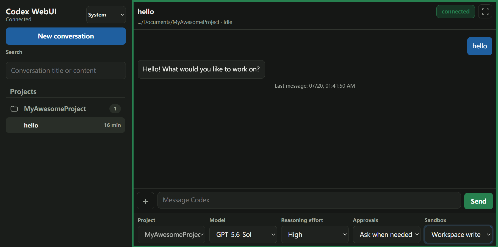
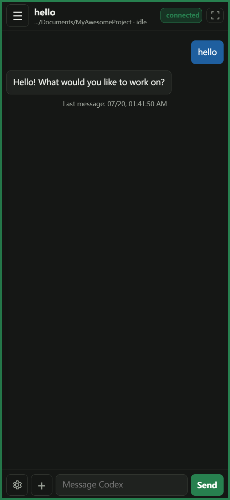

# Codex WebUI

[简体中文](README.md) | [English](README_EN.md)

Codex WebUI is a local, self-hosted web interface for OpenAI Codex. It uses the local [`codex app-server`](https://github.com/openai/codex/tree/main/codex-rs/app-server) and your existing Codex sign-in, so phones, tablets, and computers on the same LAN can create, view, and continue Codex conversations without a separate OpenAI API key. It includes English and Chinese interfaces, responsive desktop/mobile layouts, and directory-scoped access tokens.

## Installation

### Install with Codex (Recommended)

Give Codex the GitHub URL for this repository, then send:

> Install this project, run its tests, and start the service. Finally, tell me how to connect from my phone by scanning the QR code.

The repository's `AGENTS.md` tells Codex how to install, verify, and initialize the project safely.

<details>
<summary><strong>Manual installation</strong></summary>

Requirements:

- Node.js 20 or later
- A signed-in Codex CLI installation, or the Codex desktop app on Windows

```powershell
npm install
npm run setup
npm test
npm start
```

`npm run setup` installs the global `codex-webui` command. After startup, connect the phone and computer to the same LAN and scan the terminal QR code. If Windows Firewall prompts you, allow private-network access.

</details>

## Usage

| Desktop | Mobile |
| :---: | :---: |
|  |  |

> [!WARNING]
> Access links and QR codes are remote-control credentials. If one leaks, another person may read conversations, start tasks, and operate on files within the token's authorized directories. Never share them publicly; disable or rotate the token immediately if exposure is suspected.

### Frequently asked questions

- **Does it require an OpenAI API key?** No. Codex WebUI uses the existing Codex sign-in on your computer.
- **Can access be restricted?** Yes. Each token can be limited to one or more project directories.
- **Which devices are supported?** Desktop and mobile browsers on the same LAN.

### Token management

Codex WebUI creates a local access token during initial setup. Managing it directly through Codex is recommended:

1. After installation, press `Ctrl+O` in the Codex desktop app and open the installation directory to add Codex WebUI as a project.
2. Start a new conversation under that project.
3. Send Codex any of the following messages:

> List my Codex WebUI tokens.
>
> Create a mobile token named `phone` that can only access `E:\MyProject`, then generate its QR code.
>
> Allow the `tablet` token to access both `E:\ProjectA` and `E:\ProjectB`.
>
> Generate a mobile QR code or access link for `phone`.
>
> Rotate / disable / delete the `phone` token.
>
> Show usage statistics for the `phone` token.

<details>
<summary><strong>Command-line management (Optional)</strong></summary>

After installation, you can also use the `codex-webui` command from any directory:

```powershell
# Show fingerprints and folder permissions without revealing token secrets
codex-webui list

# Create a token restricted to one project directory
codex-webui add phone --label "My phone" --cwd "E:\MyProject"

# Allow one token to access multiple directories
codex-webui add tablet --cwd "E:\ProjectA" --cwd "E:\ProjectB"

# Generate the complete access URL and QR code (reveals the secret)
codex-webui qr phone

# Override automatic LAN address selection on a multi-adapter system
codex-webui qr phone --host http://192.168.1.20:9526

# Rotate, disable, or delete a token
codex-webui rotate phone
codex-webui disable phone
codex-webui remove phone --yes

# Inspect usage
codex-webui stats
codex-webui stats phone
```

Run `codex-webui help` to see all commands.

</details>

A running server reloads token changes automatically. After a token is rotated, disabled, or deleted, its old connections are rejected on their next request.

## Development

```powershell
npm run check
npm test
```

The backend starts `codex app-server` over stdio. The web page bridges WebSocket requests to Codex JSON-RPC. Allowed methods are controlled by an allowlist, while directory-restricted tokens also filter conversations and validate file access on the server.

## License

[MIT](LICENSE)
